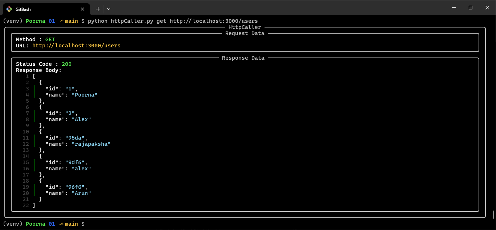
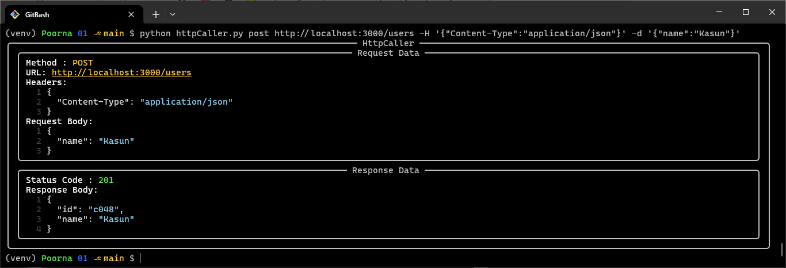
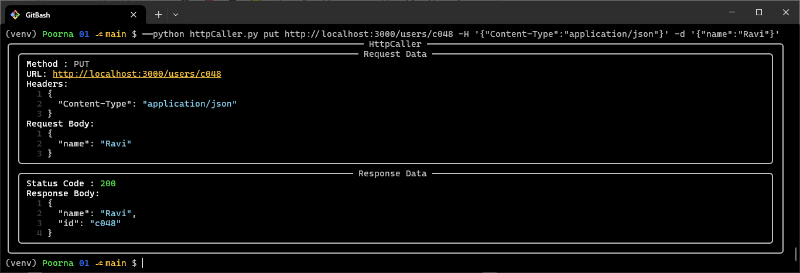
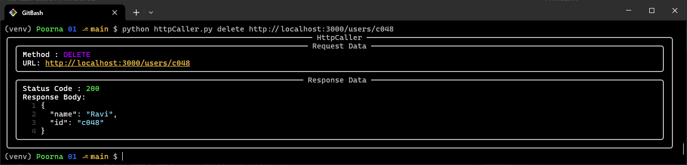

# HttpCaller

A simple terminal-based HTTP client built with Python, Typer, and Rich. It allows you to make HTTP requests (GET, POST, PUT, DELETE, etc.) and view request and response data with a clean, colored UI. JSON responses are syntax-highlighted with line numbers.

## Features

- Make HTTP requests using any method (GET, POST, PUT, DELETE, etc.)

- Pass optional JSON body data with --data (-d) option

- Pass optional HTTP headers with --header (-H) option (key:value format)

- Pretty-print request and response data using Rich panels

- Syntax-highlight JSON responses with line numbers

- Handles invalid JSON responses gracefully

## Installation

1. Clone the repository:

```bash
git clone https://github.com/Poorna-Raj/Http-Caller.git
cd Http-Caller
```

2. Install dependencies

```bash
pip install -r requirements.txt
```

## Usage

Run the tool from the terminal:

```bash
python httpCaller.py METHOD URL [--data '{"key":"value"}'] [--header "Key:Value"]
```

### Examples

- GET Request:

```bash
python httpCaller.py GET https://jsonplaceholder.typicode.com/posts/1
```

- POST request with JSON body:

```bash
python httpCaller.py POST https://jsonplaceholder.typicode.com/posts \
    --data '{"title": "Hello", "body": "World"}'
```

- GET request with headers:

```bash
python httpCaller.py GET https://api.example.com/data \
    --header "Authorization: Bearer <token>"
```

## Screenshots

1. GET Request
   
2. POST Request
   
3. PUT Request
   
4. DELETE Request
   

## Notes

- JSON responses must be valid. Invalid JSON will be displayed as plain text.

- Headers must follow the Key:Value format. Multiple headers are not supported yet.

## License

MIT License © Poorna Rajapaksha
